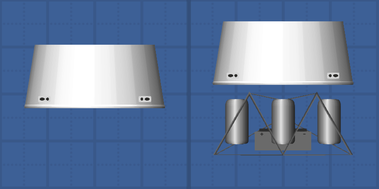
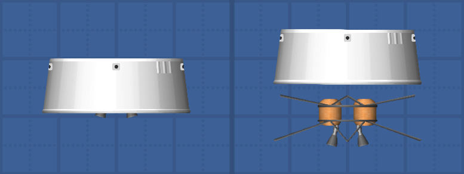
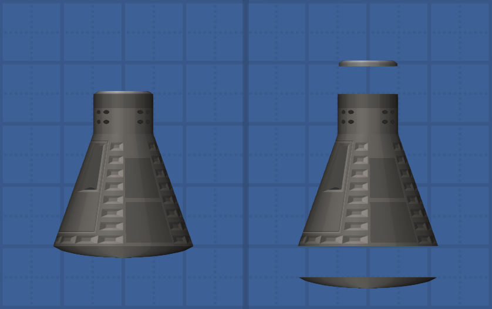
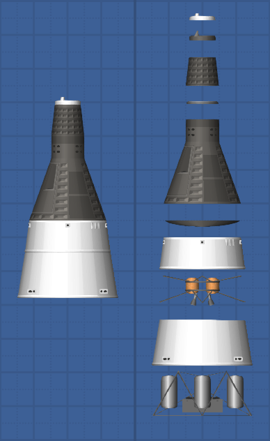

# Gemini pack for sfs

Th **gemini** **pack** is a little an simple **pack** to add **gemini** spacecraft on steam version of **Spaceflight simulator**.

Simpler description? I just can't ...

Just look at this, *service module* :

*Retro module* :

*Re-entry module* ( Capsule ) :

*Recovery section* :

***All*** :

You can see all details and description in-game.
